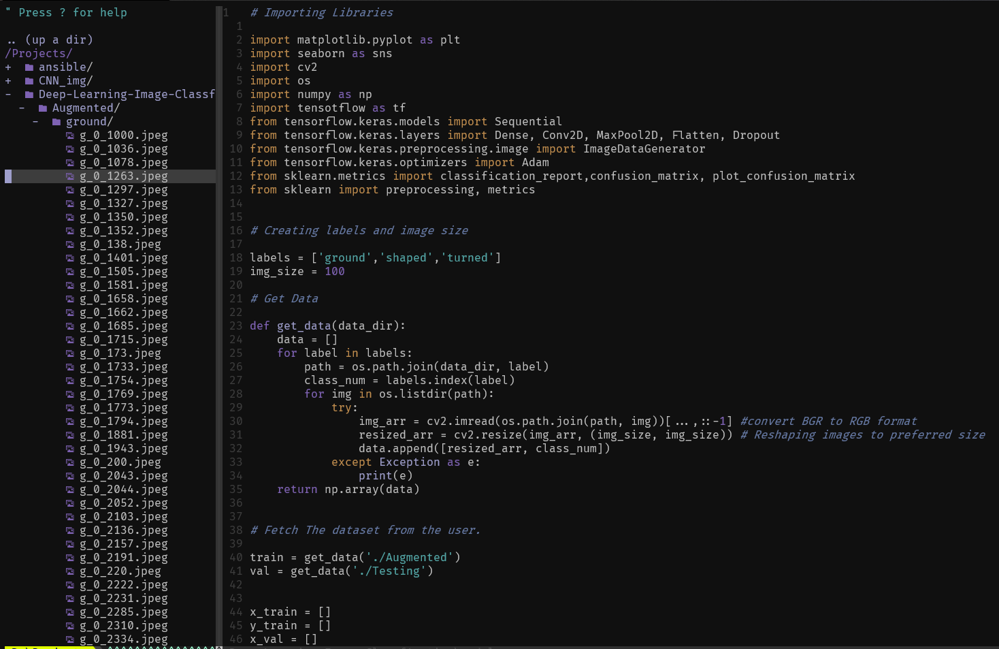
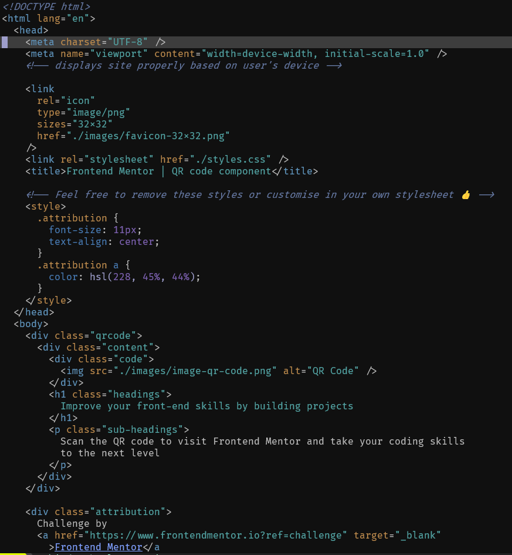
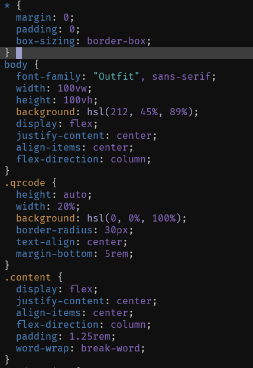
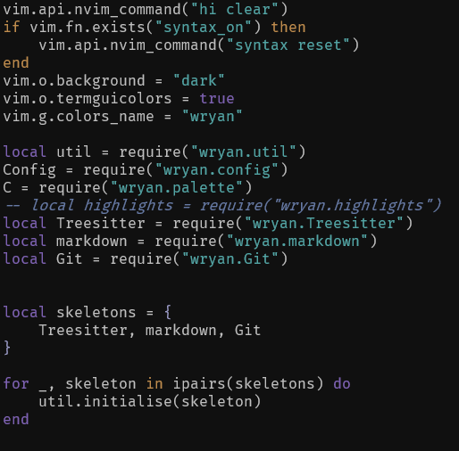
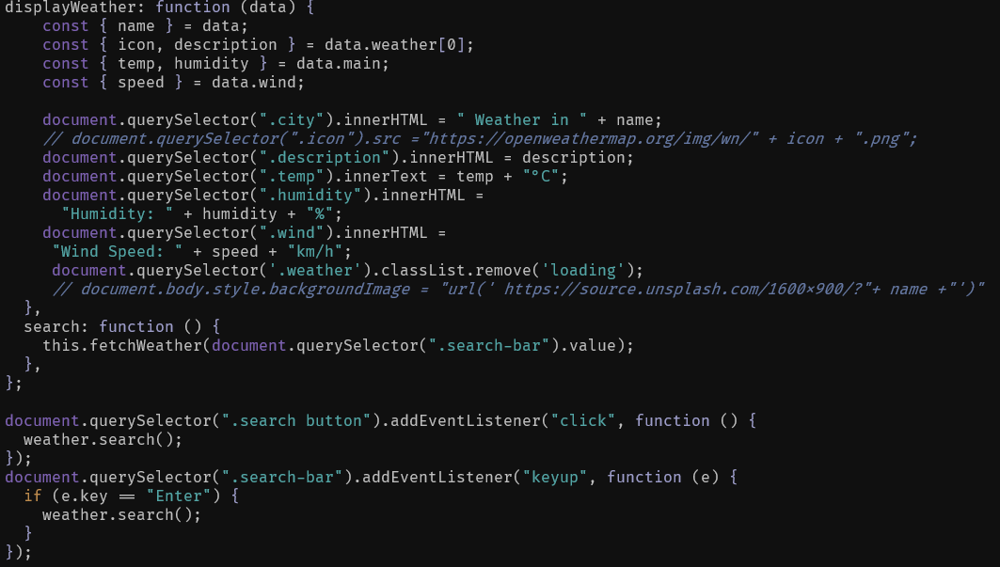
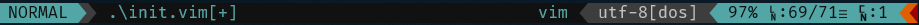
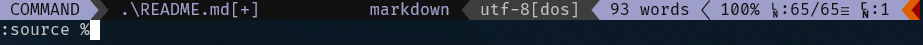

# Wryan theme for Neovim

<br>

Neovim colorscheme for the Wryan theme with [vim-airline](https://github.com/vim-airline/vim-airline) support.

<br>


<br>

## Usage

<br>

```vim

Plug 'techtuner/wryan-neovim' "Vim-Plug
Plugin 'techtuner/wryan-neovim' "Vundle

colorscheme wryan
set termguicolors
let g:airline_theme = 'wryan'

```

You have to set `set termguicolors` in the `init.vim` file for the colors to render properly.
<br>

## Screenshots

<br>

1. **HTML**
   <br>


<br>

2. **CSS**
   <br>


<br>

3. **Lua**
   <br>


<br>

4. **JavaScript**
   <br>


<br>

## Airline Support

<figure>
  
  <figcaption>Airline Normal Mode</figcaption>
</figure>
<br>

<figure>
  
  <figcaption>Airline Insert Mode</figcaption>
</figure>
<br>

<figure>
  
  <figcaption>Airline Visual Mode</figcaption>
</figure>
<br>

<figure>
  
  <figcaption>Airline Command Mode</figcaption>
</figure>